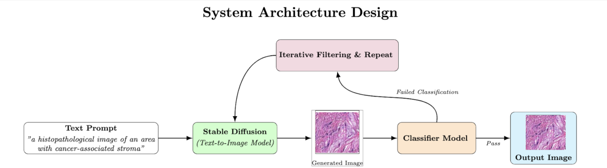
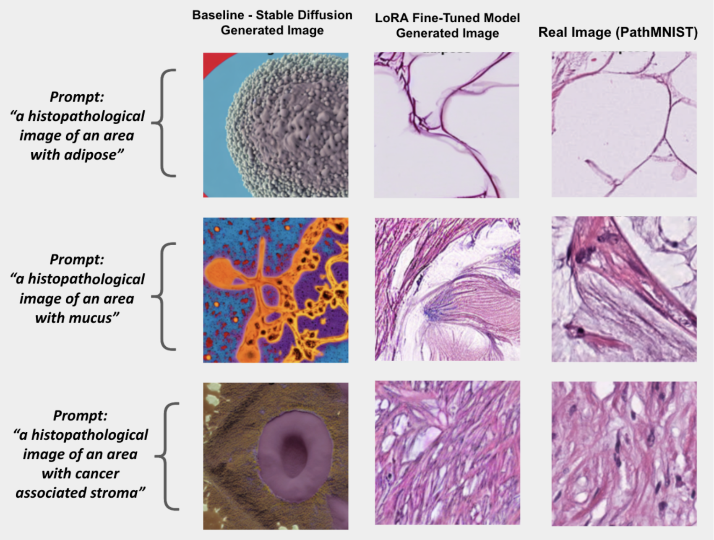
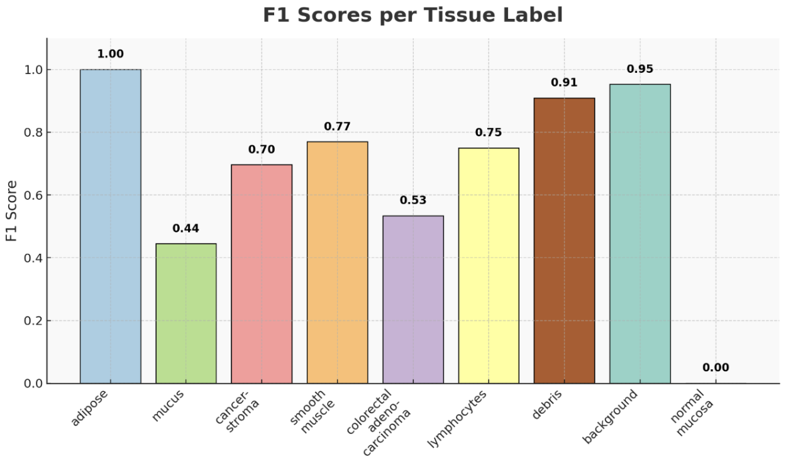
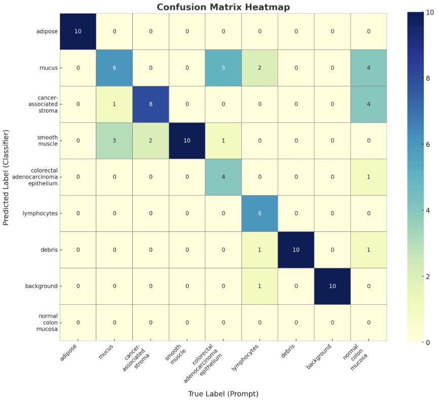

# Aiding Medical Diagnosis through Image Synthesis and Classification

> A self-validating framework for generating and classifying synthetic medical images using Stable Diffusion and ResNet.  
> 📄 [Read the full paper on arXiv](https://arxiv.org/abs/2506.00786)

---

## 📌 Overview

This project presents a practical, modular framework to streamline medical image classification workflows using synthetic data. By fine-tuning Stable Diffusion (v1.5) on class-specific data and validating outputs with a ResNet-18 classifier, this pipeline allows clinicians and researchers to simulate disease-specific image samples and verify their utility.

Rather than addressing data scarcity, this work enhances **training efficiency**, **evaluation control**, and **accessibility** for medical professionals who may lack large, curated datasets or advanced ML knowledge.

The focus is on **impact** — simplifying diagnostic AI pipelines, validating image synthesis performance, and accelerating model training through high-quality, conditionally-generated samples.

---

## 📁 Repository Structure

```bash
Aiding_Medical_Diagnosis/
├── assets/                   # Visuals from the paper (figures, metrics, diagrams)
│   ├── confusion_matrix.png
│   ├── extra_images.png
│   ├── f1_bar_graph.png
│   ├── generated_vs_real.png
│   ├── optimization.png
│   └── system_design.png
├── models/                   # Trained classifier weights
│   └── best_classification_model.pth
├── notebooks/                # Full Jupyter workflow: generation, training, testing
│   ├── classification_model_training.ipynb
│   ├── classification_model_testing.ipynb
│   ├── classifying_generated_images.ipynb
│   ├── classifying_original_dataset.ipynb
│   ├── dataset_extractor.ipynb
│   ├── finetuning_generation_model_v9.ipynb
│   └── testing_trained_generation_model.ipynb
├── prompts.txt               # Text prompts used for class-conditional generation
├── requirements.txt          # pip dependencies
├── environment.yml           # Conda environment configuration
├── LICENSE                   # MIT License
├── .gitignore
└── README.md                 # This file
```

---

## 🔍 Key Features

- 🎯 **Class-Conditional Generation**  
  Fine-tunes Stable Diffusion using LoRA on labeled data to synthesize realistic class-aligned images.

- 🧠 **Self-Validation with Classifier**  
  Validates image quality and separability by training/testing a ResNet-18 classifier on real vs. generated data.

- 📈 **Performance Reporting**  
  Includes F1 score comparisons, confusion matrices, and side-by-side visual assessments from the full pipeline.

- 🧪 **Modular Notebooks**  
  Step-by-step annotated Jupyter notebooks for extraction, generation, classification, and evaluation.

- ⚙️ **Reproducible + Lightweight**  
  Uses widely available models (Stable Diffusion v1.5, ResNet-18) and is easy to adapt to other domains.

---

## 🧪 Example Outputs

### 🔧 System Overview  
High-level diagram of the complete framework.



---

### 🎨 Real vs. Generated Images  
Visual comparison showing generated outputs next to real samples in select classes.



---

### 📊 F1 Score Comparisons  
Shows framework performance on synthetic and generated data during testing.



---

### 📉 Confusion Matrix  
ResNet confusion matrix (trained on real data, tested on real data).



## ⚙️ Setup Instructions

### 1. Clone the Repository

```bash
git clone https://github.com/Smart-Lizard/Aiding_Medical_Diagnosis.git
cd Aiding_Medical_Diagnosis
```

### 2. Create Conda Environment

```bash
conda env create -f environment.yml
conda activate Aiding_Medical_Diagnosis
```

> If you prefer pip:
> ```bash
> pip install -r requirements.txt
> ```

---

## 📓 How to Use

Each notebook is annotated and can be run in sequence:

1. `dataset_extractor.ipynb` — loads and prepares real dataset  
2. `finetuning_generation_model_v9.ipynb` — fine-tunes Stable Diffusion  
3. `testing_trained_generation_model.ipynb` — generates images for desired prompts  
4. `classification_model_training.ipynb` — trains ResNet-18 on 224x224 data
5. `classification_model_testing.ipynb` — tests on real data  
6. `classifying_original_dataset.ipynb` — baseline real data test  
7. `classifying_generated_images.ipynb` — evaluates generated images

All images and metrics in the `assets/` folder match the ones shown in the paper.

---

## 📄 License

Distributed under the [MIT License](LICENSE).  
You are free to use, modify, and distribute this code with attribution.

---

## 📚 Citation

If this project helps your work, please cite:

```bibtex
@misc{choudhary2025aiding,
      title={Aiding Medical Diagnosis: A Self-Validating Framework for Medical Image Synthesis}, 
      author={Kanishk Choudhary},
      year={2025},
      eprint={2506.00786},
      archivePrefix={arXiv},
      primaryClass={cs.CV}
}
```

---

## 📬 Contact

For questions, feedback, or collaborations:

**Kanishk Choudhary**  
📧 kanishkc2020@gmail.com  
🌐 [GitHub Repo](https://github.com/Smart-Lizard/Aiding_Medical_Diagnosis)

---
